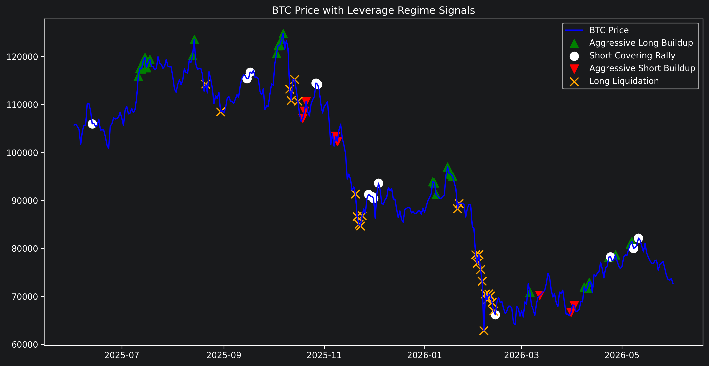
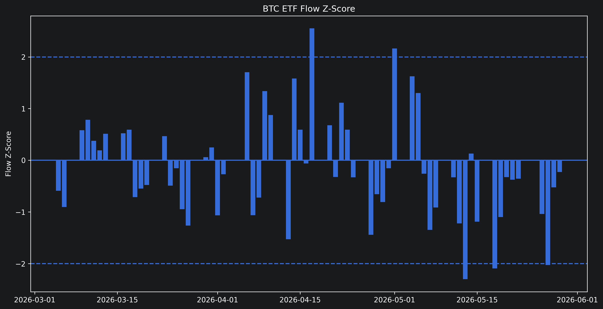
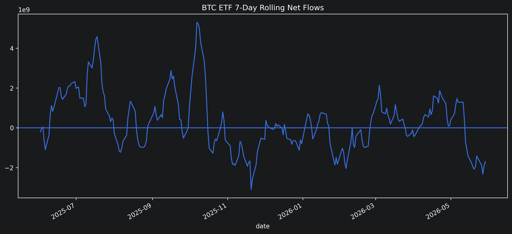
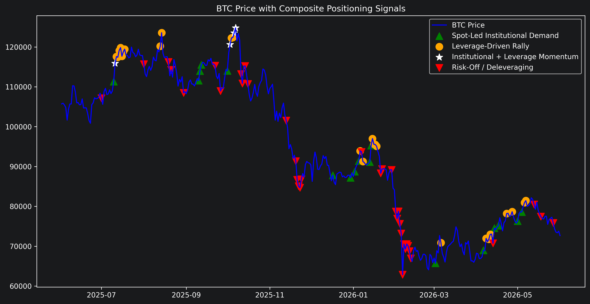

# BTC Positioning Monitor

## Overview

This project analyzes Bitcoin market structure through a combination of institutional capital flows and derivatives positioning data.

The objective is to identify periods of:

- Strong ETF Inflows
- Aggressive Long Buildup
- Aggressive Short Buildup
- Long Liquidations
- Short Covering Rallies

and evaluate how Bitcoin has historically performed following each regime.

The framework combines:

- Spot Bitcoin ETF flows (institutional demand)
- Funding rates (leverage sentiment)
- Open interest (positioning expansion and contraction)

Signals are evaluated using forward 7-day and 30-day Bitcoin returns to determine whether specific positioning environments have historically been associated with future market performance.

---

## Data Sources

### CoinGecko
- BTC Spot Price
- Trading Volume

### Hyperliquid
- Funding Rates

### CoinGlass
- Open Interest
- Spot Bitcoin ETF Flows

---

## Features

### Price & Volatility

- Daily Returns
- 7-Day Returns
- 30-Day Returns
- Rolling Volatility

### Derivatives Positioning

- Funding Rate Z-Score
- 7-Day Open Interest Change

### Institutional Flows

- Bitcoin ETF Net Flows
- ETF Flow Z-Score

---

## Positioning Regimes

### Aggressive Long Buildup

- BTC 7D Return > 3%
- Funding Z-Score > 0.5
- Open Interest Rising

### Aggressive Short Buildup

- BTC 7D Return < -3%
- Funding Z-Score < -0.5
- Open Interest Rising

### Short Covering Rally

- BTC 7D Return > 3%
- Open Interest Falling

### Long Liquidation

- BTC 7D Return < -7%
- Open Interest Falling

### Strong ETF Inflows

- ETF Flow Z-Score > 1.5

---

## Research Framework

For each signal, the project evaluates:

- Forward 7-Day BTC Returns
- Forward 30-Day BTC Returns

to determine whether positioning conditions have historically been associated with future market performance.

---

## Sample Findings

Using Bitcoin funding, open interest, and ETF flow data, the monitor identified several positioning regimes and evaluated their subsequent forward returns.

| Signal | Observations | Median 7D Return | Median 30D Return |
|---|---:|---:|---:|
| Strong ETF Inflows | 22 | +2.00% | -2.35% |
| Aggressive Long Buildup | 14 | -1.24% | -4.47% |
| Long Liquidation | 25 | -1.88% | -3.57% |
| Aggressive Short Buildup | 8 | +3.24% | -12.10% |
| Short Covering Rally | 14 | -1.74% | -3.62% |

These preliminary results suggest that different institutional flow and leverage regimes exhibit meaningfully different forward-return profiles. Additional data and larger sample sizes are needed to evaluate the robustness of these relationships.

## Sample Findings

[table here]

These preliminary results suggest that different institutional flow and leverage regimes exhibit meaningfully different forward-return profiles. Additional data and larger sample sizes are needed to evaluate the robustness of these relationships.

## Example Visualizations

### BTC Price with Leverage Regime Signals

### BTC ETF Flow Z-Score

### BTC ETF 7-Day Rolling Net Flows

### BTC Price with Composite Positioning Signals

## Notebook

The primary analysis is contained in:

`notebooks/btc_positioning_monitor.ipynb`

If GitHub notebook rendering is unavailable, a static HTML export is also included:

[View HTML Export](notebooks/btc_positioning_monitor.html)

## Disclaimer

This project is intended for educational and research purposes only and should not be interpreted as investment advice.
